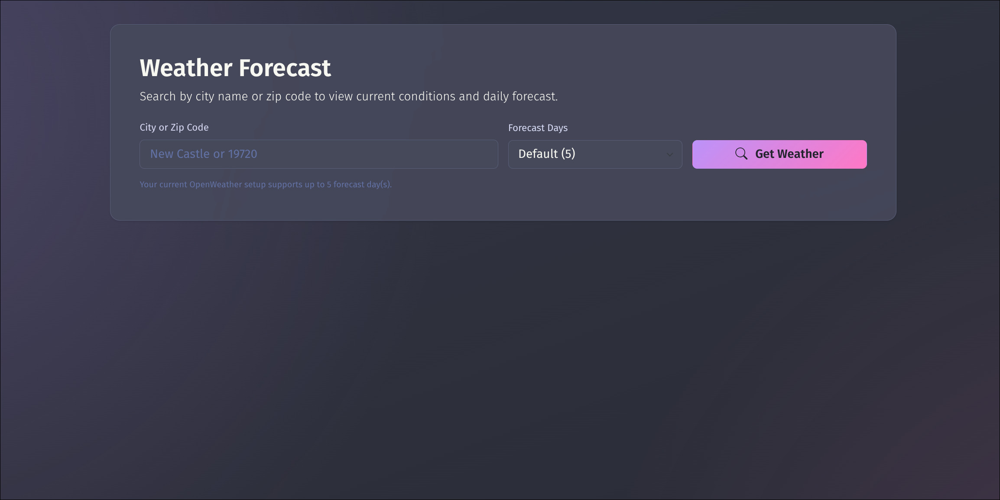
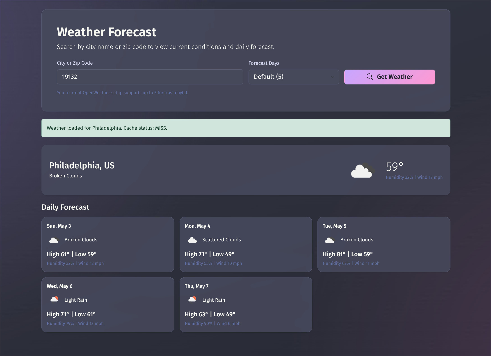

# Weather App (Docker Compose)

Weather app using HTML, Bootstrap, and JavaScript with a Node.js API proxy and Redis caching.

## Screenshots

**Search UI**



**Forecast Results**



## Features

- Search by city or zip code.
- Forecast day selector supports up to 5 days in the current UI and backend cap.
- Default forecast request is 5 days when no explicit selection is made.
- Forecast cards show daily high and low temperatures aggregated from each day of 3-hour forecast entries.
- Temperatures render with the degree symbol only (example: 72° in UI).
- Weather condition icons shown for current and forecast entries.
- API key stays server-side (not exposed to browser).
- Redis caching reduces repeated OpenWeather API pulls.
- Cache schema uses key version `weather:v2`.

## Project Structure

- `index.html` - frontend UI markup.
- `assets/css/styles.css` - custom styles.
- `assets/js/app.js` - frontend behavior.
- `server/src/server.js` - Express app bootstrap.
- `server/src/routes/weather.js` - API routes.
- `server/src/services/openweatherClient.js` - OpenWeather integration and daily forecast normalization.
- `server/src/services/cache.js` - Redis caching helpers.
- `docker-compose.yml` - web + api + redis services.

## Get OpenWeather API Key

1. Create an account at https://openweathermap.org.
2. Go to API keys: https://home.openweathermap.org/api_keys.
3. Create a key or copy an existing one.
4. Wait a few minutes for activation if the key is newly created.
5. Create local env file and add your key:

```bash
cp .env.example .env
```

```env
OPENWEATHER_API_KEY=your_real_api_key
CACHE_TTL_SECONDS=600
MAX_FORECAST_DAYS=5
MOCK_MODE=false
```

## Run Locally

1. Start the stack:

```bash
docker compose up --build
```

2. Open the app:

- http://localhost:8080

## API Behavior Notes

- Endpoint: `GET /api/weather?query=<city_or_zip>&days=<1-10>`
- Current setup caps days to `MAX_FORECAST_DAYS` (default `5`) and UI cap is 5.
- Response includes request metadata indicating whether day count was capped.
- `X-Cache` values:
- `MOCK` when `MOCK_MODE=true`
- `MISS` on first live fetch
- `HIT` for Redis cache hit
- `COALESCED` when request de-duplication reused an in-flight request

## GitHub Deployment

1. Ensure `.env` is ignored before first commit:

```bash
git check-ignore -v .env
```

2. Initialize git and commit:

```bash
git init
git add .
git commit -m "Initial commit"
```

3. Create a new empty GitHub repository, then connect and push:

```bash
git branch -M main
git remote add origin https://github.com/<your-username>/<your-repo>.git
git push -u origin main
```

4. If `.env` was ever tracked, stop tracking it before pushing:

```bash
git rm --cached .env
git commit -m "Stop tracking .env"
```

## Security Note

- Keep secrets only in `.env`.
- Commit only `.env.example`.
- Rotate your OpenWeather API key immediately if it was ever exposed.